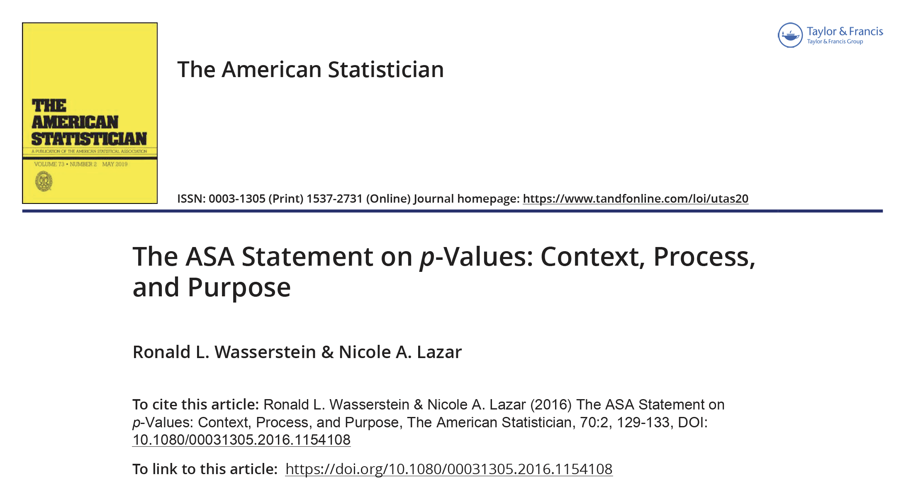
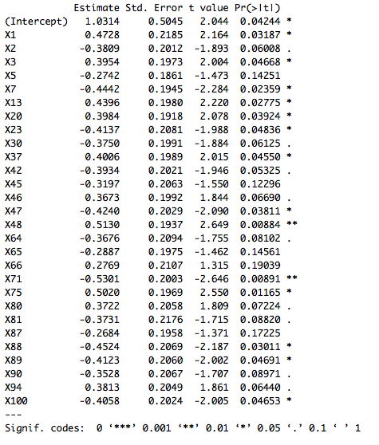
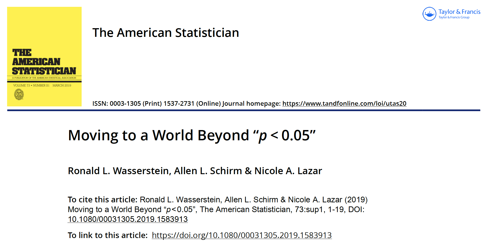

```{r, include  = FALSE, message= FALSE, warning = FALSE}
library(ggplot2)
library(dplyr)
knitr::opts_chunk$set(echo = FALSE, message = FALSE, fig.align='center')
```

.pull-left[
# Aims of this lesson

- Provide a reminder of the Statistical Testing approach. 

- Define the P-value in a general sense.

- Address common misunderstandings in its use. 
]

--

.pull-right[
# Outline

1. Statistical testing

2. P-values

3. Misunderstandings and Misuses

4. Some alternatives

5. References
]

---
class: inverse, center, middle

# 1. Statistical Testing

---
# Formulation
.pull-left[

### Basic Elements

- We have **Data** in the form of a **sample**.

- There's a **Hypothesis** about the data generating process that we want to **falsify**.

- We formulate an **Alternative** Hypothesis.

- We compute a **Test Statistic** using the sample.

]

--

.pull-right[

### Testing procedure

.content-box-red[
 
How _plausible_ is it that I have obtained this Data _under the Null Hypothesis_ ?

]

.content-box-oil[

Evidence _against the Null Hypothesis_:

- The data are _incompatible_ with a specified statistical model.
- _Reject it_ in favour of the Alternative.

]

.content-box-marine[

_Not enough evidence against_ the Null: 

- Do not Reject it

]

]

---
class: inverse, center, middle

# 2. P-values

--

### A way of **quantifying** the incompatibility between the **Hypothesis** and the **Data**. 

--

### Measures how **_extreme_** is the value of the **test statistic**

---

# An illustration : Regression Coefficients

.pull-left[
.content-box-marine[

$$\log \frac{\mathbb{P}(\text{recovery})}{1-\mathbb{P}(\text{recovery})} = \beta_0 + \beta_1 \text{treatement} + \text{factors}$$

.content-box-oil[

- **Null Hypothesis**: $H_0 : \beta_1 = 0$

- **Data** 

- **Test Statistic** $T$  

$$\hat{\beta}_{1}\overset{a}{\underset{H_0}{\sim}} N[0, \text{s.e.}(\hat{\beta}_{1})) \Rightarrow T = \frac{\hat{\beta}_{1}}{\text{s.e.}(\hat{\beta}_{1})} \overset{a}{\underset{H_0}{\sim}} N(0,1)$$
- **Alternative** Hypothesis $H_A:\beta_1\neq0$
]
]
]
]
--
.pull-right[
```{r, fig.align='center', fig.height = 3}
ggplot(data.frame(x = c(-4, 4)), aes(x))+ 
  stat_function(fun = dnorm) +
  ylab("density")
```

```{r, fig.align='center', fig.height = 3}
ggplot(data.frame(x = c(-4, 4)), aes(x))+ 
  stat_function(fun = dnorm) +
  ylab("density")
```
]
---
class: dark, center, middle

## $P(|T| > |t_{obs}|) > \alpha \Rightarrow$ **Do not Reject** $H_0$

--

## $P(|T| > |t_{obs}|) < \alpha \Rightarrow$ **Reject** $H_0 \Rightarrow$ **Accept** $H_A$ 

--

## $\beta_1$ is "statistically significant"

---
class: inverse, center, middle

# 3. Misunderstandings and Misuses

---

class: center, middle

 </img>


---
## P-values can indicate how incompatible the data are with a specified statistical model.

### However... 

--
1. _P-values **do not measure the probability that the studied hypothesis is true**, or the **probability that the data were produced by random chance alone**_.

--

2. _Scientific conclusions and business or policy decisions **should not be based only on whether a p-value passes a specific threshold**_.

--

3. _Proper inference requires full reporting and transparency_

--

4. _A p-value, or statistical significance, **does not measure the size of an effect or the importance of a result**_.

--

5. _**By itself**, a p-value **does not provide a good measure** of evidence regarding a model or hypothesis._

---
class: center, middle

 </img>

[Scientific Studies: Last Week Tonight with John Oliver (HBO)](https://youtu.be/0Rnq1NpHdmw)

---
class: center, middle

 </img>

---
class: inverse, center, middle

# 4. Some alternatives

--

## **Confidence Intervals** 

### Are random by construction. 

### Provide the same inferential without some of the interpretation drawbacks.

---
class: center, middle

 </img>

---
class: inverse, center, middle

# 4. Some Sources

---
# Articles

- Ziliak, S., & McCloskey, D. N. (2008). The cult of statistical significance: How the standard error costs us jobs, justice, and lives. University of Michigan Press.
- Ronald L. Wasserstein & Nicole A. Lazar (2016) The ASA Statement on p-Values: Context, Process, and Purpose, The American Statistician, 70:2, 129-133,  [DOI:10.1080/00031305.2016.1154108](10.1080/00031305.2016.1154108)
- Ronald L. Wasserstein, Allen L. Schirm & Nicole A. Lazar (2019) Moving to a World Beyond "p<0.05", The American Statistician, 73:sup1, 1-19, [DOI: 10.1080/00031305.2019.1583913](10.1080/00031305.2019.1583913)
